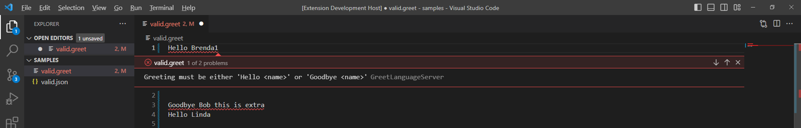

# Hello LSP - an incremental introduction to the Language Server Protocol

***Work in Progress***

***TODO: This is too long for a readme now.  Split out into docs.***

The [Language Server Protocol](https://microsoft.github.io/language-server-protocol/) (LSP) provides a way to build editor services for a language that aren't tied to a specific editor or IDE.  [VSCode](https://code.visualstudio.com/api/language-extensions/language-server-extension-guide), [neovim](https://neovim.io/doc/user/lsp.html) and [emacs](https://www.emacswiki.org/emacs/LanguageServerProtocol), for example, all support the LSP at time of writing, meaning a single LSP implementation can be used in all 3 editors.  Actually, that's not quite true.  Whilst the server component of an LSP implementation can be used as-is, each editor has a different way of integrating the LSP server into the editor.  This example focuses on vscode - so the client is vscode specific and written in typescript.  The server is in python [^0] using the excellent [pygls](https://github.com/openlawlibrary/pygls) library.

[^0]: why Python?  Because it illustrates using a different language for client and server, it's a popular language, and there are good libraries to support development and testing.  The client has to be in javascript or typescript - that's a vscode constraint.

## Overview

There are overviews of the LSP on [Microsoft's official site](https://microsoft.github.io/language-server-protocol/), the [community site](https://langserver.org/) and others too.

The [LSP spec](https://microsoft.github.io/language-server-protocol/specifications/specification-current/) summarises it thus:

<a name="lsp-overview"></a>
> The Language Server protocol is used between a tool (the client) and a language smartness provider (the server) to integrate features like auto complete, go to definition, find all references and alike into the tool 

That's good enough for here; there's plenty more at the sites above.  We'll focus below on implementing a working LSP client and server, building it incrementally.

## The Language

If we're to implement a language *server*, we need a *language*.  Real language servers deal with programming languages.  Implementing programming languages is an entire body of theory and practice in itself and that's not the objective here (though, if that's your bag, you could do a lot worse that starting with Bob Nystrom's [Crafting Interpreters](https://craftinginterpreters.com/)).  

Thankfully we don't need anything approaching the complexity of a real programming language to implement a language server: we can use something simpler instead.  *Much* simpler, in fact.  Let's call the language *greet*: it's only purpose is to express simple greetings.  First, a couple of examples:

    Hello bob
    Goodbye Nellie

That's it.  Each phrase consists of just two words: a *salutation* - "Hello" or "Goodbye" - and a name.  Here's a grammar[^1] for the language:

[^1]: It's common to formally describe the syntax of a programming language with a grammar, often defined in *Backus-Naur Format* (BNF).  See e.g. [wikipedia](https://en.wikipedia.org/wiki/Syntax_(programming_languages) for more information.

<a name="greet-grammar"></a>

```bnf
    greeting    ::= salutation name
    salutation  ::= 'Hello' | 'Goodbye'
    name        ::= [a-zA-Z]+
```

In words, that says:

* A `greeting` comprises a `salutation` followed by a `name`
* A `salutation` is the word `Hello` or the word `Goodbye`
* A `name` is one or more letters, either lower or upper case.  Note there can't be any spaces between the letters: `Nellie` is fine but `Nellie bob` isn't.

We'll write some code to 'implement' the language [a bit later](#language-implementation).  First though, let's look at the structure of the solution.

## Solution Overview

If you know the basics of how LSP works, [skip ahead to the implementation skeleton](#implementation-skeleton).

As per the introduction, the solution comprises 2 parts:

* the *client* integrates with the editor - vscode in this case.  Each editor has its own approach to integrating extensions.  Editors support extensions for many languages - so our extension will be one of several installed in any deployment.  The client has to comply with that, so it's job is broadly to:
  * tell the editor what language it supports
  * liaise between the editor and the server
* the *server* provides the smarts on the language (as per the overview quote [above](#lsp-overview))

Though vscode calls these "extensions", I'm going to use "plugin" from here on in.  The reason is that "extension" is also used when referring to filenames (e.g. the `.py` part in `file.py`).  We need to refer to both, so I'll use `plugin` for the things that provide language support, and `extension` specifically when referring to file names.

<a name="protocol-overview"></a>

### Client-Server Interaction

The client and server communicate using the language server protocol itself.  It defines two types of interactions:

* **Notifications**.  For example, the client can send a `textDocument/didOpen` notification to the server to indicate that a file, of the type supported by the server, has been opened.  Notifications are one-way events: there's no expectation of a reply.  In this case, the client is just letting the server know a file has been opened.  There's no formal expectation of what the server does with that knowledge.  Though, in this case, a reasonable outcome would be for the server to read the file in preparation for subsequent requests.
* **Request/response pairs**.  For example, the client can send the  `textDocument/definition` request to the server if the user invokes the "go to definition" command (e.g. to jump to the implementation of a function from a site where it's called).  The server is expected to respond, in this case with a `textDocument/definition` response.  (As a side note: both client and server can issue requests - not just the client).  

Interactions are encoded using [JSON-RPC](https://www.jsonrpc.org/).  Here's an example (taken from the [official docs](https://microsoft.github.io/language-server-protocol/overviews/lsp/overview/)):

```json
{
    "jsonrpc": "2.0",
    "id" : 1,
    "method": "textDocument/definition",
    "params": {
        "textDocument": {
            "uri": "file:///p%3A/mseng/VSCode/Playgrounds/cpp/use.cpp"
        },
        "position": {
            "line": 3,
            "character": 12 
        } 
    } 
}
```

It's pretty self-explanatory:

* The `method` - aka the request - is `textDocument/definition`
* The `uri` defines the document the user is editing
* the `position` defines the line and column in the file that the user's cursor was at when they invoked the "go to definition" command.

The position highlights an important point on how the editor and server communicate. It's all founded on the location in a file, comprising line (row) and column.

Here's a typical response (again from the [official docs](https://microsoft.github.io/language-server-protocol/overviews/lsp/overview/)):

```json
{
  "jsonrpc": "2.0",
  "id": 1,
  "result": {
    "uri": "file:///p%3A/mseng/VSCode/Playgrounds/cpp/provide.cpp",
    "range": {
      "start": {
        "line": 0,
        "character": 4
      },
      "end": {
        "line": 0,
        "character": 11
      }
    }
  }
}
```

Again, fairly explanatory:

* the `id` is used to correlate the response with the request.  The user might, for example, have changed their mind and started typing again, in which case the editor needs to know it can discard the response.
* the `result` contains the response to the request.  It says:
  * The definition of the symbol referred to in the request is contained in the file specified by the `uri`.  Note it's a different file to the uri in the request.
  * The `start` and `end` define the line & column positions that delimit the definition.  For example, this could be the first and last characters of the name of the function being referenced.  

It's entirely up to the server to decide what constitutes the definition.  Note, again, the use of line and column to define position.

<a name="implementation-skeleton"></a>

## Implementation Skeleton

OK, enough of the talking - let's code.  I'm assuming a Unix-like environment below, with a `bash` shell.  That should work for Linux, MacOS and Windows subsystem for Linux (WSL).  

### Pre-Requisites

We're using vscode as the editor, so you need to [install it first](https://code.visualstudio.com/download).  You'll also need to install [git](https://git-scm.com/),   [Node.js](https://nodejs.org/) and [Python](https://www.python.org/downloads/).  Then create a new directory to hold the project:

```bash
$ cd /my/projects/dir
$ mkdir helloLSP 
$ cd helloLSP
```

There's a fair bit of boilerplate that needs to be in place before we can really get started on implementing support for `greet`.  It's a bit fiddly and difficult to get right from first principles.  However, luckily, we don't need to. I used [this example](https://github.com/openlawlibrary/pygls/tree/master/examples/json-vscode-extension) as a template.  There are [many](https://microsoft.github.io/language-server-protocol/implementors/servers/) [examples](https://github.com/openlawlibrary/pygls/tree/master/examples) [available](https://github.com/microsoft/vscode-python-tools-extension-template) and reading some others too is worthwhile to get a sense of what's involved.

To build initially and check it's working:

1. Set up the Server Python environment

    ```bash
    $ python3 -m venv venv
    $ source venv/bin/activate
    $ python3 -m pip install -U pip
    $ python3 -m pip install pygls
    ```

1. Set up the client nodejs environment

    ```bash
    $ npm install
    $ cd client
    $ npm install
    $ cd ..
    ```

1. Start vscode in the project root dir

    ```bash
    $ code .
    ```

1. Edit [.vscode/settings.json](vscode/settings.json) to ensure the python interpreter path is set correctly:

    ```json
    {
        "python.interpreterPath": "${workspaceFolder}/venv/bin/python3"
    }
    ```

    You'll need to adjust this as required for your platform.  On Windows, this is likely to be `${workspaceFolder}/venv/Scripts/python`.

1. Run the extension client and server in a separate "development" instance of vscode by typing `ctrl-shift-D`, selecting `Server + Client` in the "Launch" dropdown at the top of the screen, and hitting `F5`.

1. In the development instance of vscode, open the `samples` sub-directory of this project.

1. Open the sample json file.  The editor should show an information message at the bottom of the main window that says "Text Document Did Open".

With that done, the basics are all in place.  Close the development instance for now and go back to the main project instance.  The code at this point is [tagged as v0.1](https://github.com/sfinnie/helloLSP/releases/tag/v0.1) if you want to have a look.

## Anatomy of the Plugin

Despite all the boilerplate, there are 3 primary files that implement the plugin:

* [client/src/extension.ts](client/src/extension.ts) implements the client
* [server/server.py](server/server.py) implements the server.
* [package.json](./package.json) describes the capabilities that the client and server provide.


## Tidying up the skeleton

***Note:*** if you're eager to get onto actually implementing language support, then [skip ahead](#language-implementation).  This section cleans up the skeleton and gets ready for that.  Understanding how things fit together can be instructive, but if it's not your bag, move along.  

With the skeleton in place, we can start making the changes needed to support our `greet` language.   There are a few housekeeping tasks to complete:

1. Change the plugin so it's activated on files with a `.greet` extension (the skeleton is activated for `json` files)
1. Get rid of the extraneous commands supported by the skeleton that we don't need.
1. Rename the relevant classes, methods and names from `json` to `greet`

### Tiny baby steps - setting the language

Let's start with the filename extension.  There's actually 2 parts to this, because vscode separates language *identity* from the filename *extension*.  That allows a single language to support multiple extensions.  For example: the Java tooling supports both `.jav` and `.java` extensions.

The language and extension(s) are configured in the `package.json` file.  The relevant section in the skeleton reads as follows:

```json
"activationEvents": [
    "onLanguage:json"
  ],
```

We need to make a few changes.  For a start, the skeleton assumes vscode already knows about `json` as a language.  It won't know anything about `greet` though.  So we need to define the language identity, define the file extensions, and let vscode know when to activate our plugin.  Here's what that looks like[^4]

[^4]: It's not strictly necessary to include the `activationEvents` section: vscode infers that from language contributions in recent versions.  There's no downsides to doing so though, and means the extension will work with older versions of vscode.

```json
"contributes": {
    "languages": [
      {
        "id": "greet",
        "aliases": [
          "Greet",
          "greet"
        ],
        "extensions": [
          ".greet"
        ]
      }
    ]
},
"activationEvents": [
    "onLanguage:greet"
  ],
```

It's also referenced in [extension.ts](client/src/extension.ts):

```typescript
function getClientOptions(): LanguageClientOptions {
    return {
        // Register the server for plain text documents
        documentSelector: [
            { scheme: "file", language: "json" },
            { scheme: "untitled", language: "json" },
        ],
    //...
```

We need to change that to:

```typescript
function getClientOptions(): LanguageClientOptions {
    return {
        // Register the server for 'greet' documents
        documentSelector: [
            { scheme: "file", language: "greet" },
            { scheme: "untitled", language: "greet" },
        ],
    //...
```

With those changed, we can launch the plugin in a development window again (`ctrl-shift-D`, select "Server + Client", hit `F5`).  Open `samples/valid.greet` in the editor and, again, you should see the `Text Document Did Open` message. Close the development instance.  Change 1 complete.


### Cleaning up 

The skeleton plugin implements multiple commands for illustration.  We don't need them here, so they can be removed.  If you run the plugin in a development instance and type `ctrl-shift-p` then enter "countdown" in the dialogue box, you should see several options like "Count down 10 seconds [Blocking]".  We don't need those. That needs changes in 2 places:

* `package.json`, which declares the commands the plugin supports
* `server.py` which implements them.

Here's an excerpt from each.

```json
//package.json
    "commands": [
      {
        "command": "countDownBlocking",
        "title": "Count down 10 seconds [Blocking]"
      },
      // several more
    ]
```

```python
# server.py
class JsonLanguageServer(LanguageServer):
    CMD_COUNT_DOWN_BLOCKING = 'countDownBlocking'
    # several more
 
@json_server.command(JsonLanguageServer.CMD_COUNT_DOWN_BLOCKING)
def count_down_10_seconds_blocking(ls, *args):
    """Starts counting down and showing message synchronously.
    It will `block` the main thread, which can be tested by trying to show
    completion items.
    """
    for i in range(COUNT_DOWN_START_IN_SECONDS):
        ls.show_message(f'Counting down... {COUNT_DOWN_START_IN_SECONDS - i}')
        time.sleep(COUNT_DOWN_SLEEP_IN_SECONDS)

```

The link between the two is the `countdownBlocking` literal.  Removing the unnecessary commands requires removing:

1. the "commands" entry in `package.json`
1. The corresponding constant definition in the `JsonLanguageServer` class
1. The python function that implements the class

We'll remove the configuration and code for the following commands:

* countDownBlocking
* CountDownNonBlocking
* showConfigurationAsync
* showConfigurationCallback
* showConfigurationThread

Launching the development instance, typing `ctrl-shift-p` and entering "countdown" now doesn't show up our commands.  Task complete.

## Naming: enough, already, Json

The skeleton is based on suport for `json` files, and that's used throughout [extension.ts](./client/src/extension.ts), [server.py](server/server.py) and [package.json](package.json).


### Package.json

Let's start with `package.json`.  The first chunk of relevance sits right at the top of the file:

```json
{
  "name": "json-extension",
  "description": "Simple json extension example",
  "author": "Open Law Library",
  "repository": "https://github.com/openlawlibrary/pygls",
  "license": "Apache-2.0",
  "version": "0.11.3",
  "publisher": "openlawlibrary",
  //...
```
We can change that as follows:

```json
{
  "name": "greet",
  "description": "Support for the greet salutation example language",
  "author": "sfinnie",
  "repository": "https://github.com/sfinnie/helloLSP",
  "license": "Apache-2.0",
  "version": "0.0.1",
  "publisher": "sfinnie",
```

The next bit is the configuration section.  It currently reads:

```json
    "configuration": {
      "type": "object",
      "title": "Json Server Configuration",
      "properties": {
        "jsonServer.exampleConfiguration": {
          "scope": "resource",
          "type": "string",
          "default": "You can override this message."
        }
      }
    }
```

It's a bit academic, because we don't have any configuration at the moment. It's helpful to see how it fits together though, so let's leave it in but update it:

```json
    "configuration": {
      "type": "object",
      "title": "Greet Server Configuration",
      "properties": {
        "greetServer.exampleConfiguration": {
          "scope": "resource",
          "type": "string",
          "default": "Greet says you can override this message."
        }
      }
    }
```

That's `package.json` done.  Let's do the client next.

### extension.ts

The only relevant section in the client is in the `getClientOptions()` function that we update earlier.  Here's how it looks currently:

```typescript
function getClientOptions(): LanguageClientOptions {
    return {
        // Register the server for 'greet' documents
        documentSelector: [
            { scheme: "file", language: "greet" },
            { scheme: "untitled", language: "greet" },
        ],
        outputChannelName: "[pygls] JsonLanguageServer",
```

It's the last line we want to change, as follows:
```typescript
        outputChannelName: "[pygls] GreetLanguageServer",
```
I've left `[pygls]` in there.  It's completely optional, but it might be useful to know that's what the server is based on.  If nothing else, it's a nice little acknowledgement for the good folks who put `pygls` together and shared it with the world.


That's it for the client - onto the server.

### server.py

The change in the server is the main language server class:

```python
class JsonLanguageServer(LanguageServer):
    CMD_PROGRESS = 'progress'
    #...

json_server = JsonLanguageServer('pygls-json-example', 'v0.1')
```

Unsurprisingly, that becomes:

```python
class GreetLanguageServer(LanguageServer):
    CMD_PROGRESS = 'progress'
    #...

greet_server = GreetLanguageServer('pygls-json-example', 'v0.1')
```

`greet_server` is referenced in several places in the file, so they all need updated.  Same with `GreetLanguageServer`.

There's a couple of functions for validating the contents of a file (`_validate()`, `_validate_json()`).  We're going to update them later, so can leave the `json` references for now.

That's the renaming complete.  Time, at last, to actually start implementing our support for greet.


<a name="language-implementation"></a>

## Implementing Greet Language Support

Hurrah!  Finally time to implement the language support.  But what does that actually mean?  The Language Server Protocol defines several [language features](https://microsoft.github.io/language-server-protocol/specifications/lsp/3.17/specification/#languageFeatures), for example:

* [Goto Declaration](https://microsoft.github.io/language-server-protocol/specifications/lsp/3.17/specification/#textDocument_declaration)
* [Find References](https://microsoft.github.io/language-server-protocol/specifications/lsp/3.17/specification/#textDocument_references)
* [Completion Items](https://microsoft.github.io/language-server-protocol/specifications/lsp/3.17/specification/#textDocument_completion)

We'll start with checking that a `greet` file is consistent with the [grammar](greet-grammar).  We know from [earlier](#protocol-overview) that notifications can be sent from the client to the server and vice-versa.  One of those notifications is `textDocument/didOpen` which is sent when a document, of the type supported by the plugin, is opened. We saw that in the development instance: it displayed the message `Text Document Did Open` when we opened a file with the `.greet` extension.  Here's the source of that in `server.py`:

<a name="did-open"></a>

```python
@greet_server.feature(TEXT_DOCUMENT_DID_OPEN)
async def did_open(ls, params: DidOpenTextDocumentParams):
    """Text document did open notification."""
    ls.show_message('Text Document Did Open')
    _validate(ls, params)
```

It's pretty self-explanatory.  The `@greet_server.feature` line is where `pygls` does its magic.  Behind that simple line, `pygls` manages receiving the notification in `json-rpc` format, parsing out the parameters into a `DidOpenTextDocumentParams` object, and calling the `did_open` function.  Aside from showing the message we saw on screen earlier[^5], the function calls `_validate()` to check the file contents [^6]. 

[^5]: Just in case you're in any doubt, change the message to something like 'Text Document Did Open a greet file' and launch a development instance.  Open a `.greet` file, and marvel at the outcome.

[^6]: the underscore is a convention to indicate that `validate()` is a function only intended for use inside `server.py`.  


The skeleton `_validate()` function checks whether the file is valid `json` so we need to change that.  The compiler world tends to talk about *parsing* rather than *validating*.  It's a bit pedantic, but I'm going to stick to that here.  So the functions we'll look at are named `_parse()` not `_validate()`.  The skeleton functions cover the following:

1. Extracting the source file contents from the parameters
1. Checking the contents

It's worth noting at this point that the `DidOpenTextDocumentParams` object contains the *actual content* of the file being edited, not just a `uri` reference for it.  This is a deliberate design decision in the protocol.  From the [spec](https://microsoft.github.io/language-server-protocol/specifications/lsp/3.17/specification/#textDocument_didOpen):

> The document’s content is now managed by the client and the server must not try to read the document’s content using the document’s Uri. 

Back to the functions.  The first one doesn't change (other than the name):

```python
def _parse(ls: GreetLanguageServer, params: DidOpenTextDocumentParams):
    ls.show_message_log('Validating json...')

    text_doc = ls.workspace.get_document(params.text_document.uri)

    source = text_doc.source
    diagnostics = _parse_greet(source) if source else []

    ls.publish_diagnostics(text_doc.uri, diagnostics)
```

Note the error handling if there's no source content.  `ls.publish_diagnostics()` passes any errors found back to the client for display in the editor.  The meat is in the `_parse_greet()` function.  How do we parse the file?  The grammar tells us the rules for a greeting, but how do we implement it?  The skeleton takes advantage of Python's `json.loads()` function to do the parsing.  Here's the skeleton implementation:

```python
def _parse_greet(source):
    """Validates json file."""
    diagnostics = []

    try:
        json.loads(source)
    except JSONDecodeError as err:
        msg = err.msg
        col = err.colno
        line = err.lineno

        d = Diagnostic(
            range=Range(
                start=Position(line=line - 1, character=col - 1),
                end=Position(line=line - 1, character=col)
            ),
            message=msg,
            source=type(greet_server).__name__
        )

        diagnostics.append(d)

    return diagnostics
```

The majority of the code deals with creating the `Diagnostic` - the data structure that informs the editor where the error lies, and what the problem is.

Not unreasonably, Python's standard library doesn't have a built-in function for loading `.greet` files.  There's lots of well-established [theory](https://en.wikipedia.org/wiki/Parsing) on parsing, several techniques, and lots of libraries to support it.  That's a bit overkill for our needs here though.  Our approach is broadly:

1. Read in the file, breaking it up into lines
1. For each line, check if it contains a valid greeting:
    1. Does it start with either "Hello" or "Goodbye"?
    1. If so, is it followed by a name that satisfies the `[a-zA-Z]+` pattern?

Here's the implementation:

```python
def _parse_greet(source: str):
    """Parses a greeting file.  Generates diagnostic messages for any problems found"""
    diagnostics = []

    grammar = re.compile(r'^(Hello|Goodbye)\s+([a-zA-Z]+)\s*$')

    lines = [line.rstrip() for line in source.splitlines()]
    for line_num, line_contents in enumerate(lines):
        if len(line_contents) == 0:
            # Don't treat blank lines as an error
            continue
        
        match = re.match(grammar, line_contents)
        if match is None:
            d = Diagnostic(
                    range=Range(
                        start=Position(line=line_num, character=0),
                        end=Position(line=line_num, character=len(line_contents))
                    ),
                    message="Greeting must be either 'Hello <name>' or 'Goodbye <name>'",
                    source=type(greet_server).__name__
                )
            diagnostics.append(d)

 
    return diagnostics
```

The first thing to note is the grammar:

```python
grammar = re.compile(r'^(Hello|Goodbye)\s+([a-zA-Z]+)\s*$')
```

 It's a [regular expression](https://docs.python.org/3/howto/regex.html) (regex) and shows off the pros and cons of using them.  On the 'pro' side, it's a very succinct way of expressing the grammar.  On the 'con' side, it's a very succinct way of expressing the grammar.  This is about the limit of complexity I'm personally comfortable with: it's still readable with some concentration.  Much more than this, though, and I'd want to take a different approach.  For sake of clarity, let's break it down.

 * The `^` means the grammar must match the start of the line: there can't be any characters (including white space) before the first pattern
 * The first pattern matches the salutation: `(Hello|Goodbye)` means match ths string 'Hello' or the string 'Goodbye'.  The brackets mean the match will capture which string matched: we're not using that here but will later.
 * The second pattern - `\s+` - means match one or more white space characters after the salutation and before what follows.  `\s` means match a single whitespace character (space, tab); `+` means match one or more.
 * The third pattern matches the name: `([a-zA-Z]+)`.  This is exactly the same as the formal grammar defined [above](#greet-grammar).  Again, the surrounding brackets mean the value should be captured if match is successful
 * The final pattern - `\s*$` - means match zero or more whitespace characters before the end of the line.  `\s` means match a single whitespace character as before; `*` means match zero or more; and `$` means match the end of the string.

 We iterate through each line in the file in turn, checking if it matches the grammar.  If it doesn't, we create a `Diagnostic` instance that specifies the location of the problem and the error message to show.  In this first incarnation, we're not breaking down where the error lies.  That's viable with a grammar as simple as `greet` in its current form.  Anything more complex and we'd want to be a bit more specific with error messages, but it's plenty good for now.  Spin up a development instance (`ctrl-shift-D` and `f5`), open the sample .greet file, and have a play.  The editor should show a red squiggly for any lines that don't match the grammar, and show the diagnostic message if you hover over an error:

 

Play about in the development instance, and the editor will respond as a line moves between being valid and invalid.  Now, if you've had your porridge/coffee/whatever, and are feeling super alert, you might be wondering why.  So far, we've only looked at the `textDocument/didOpen` message.  That only gets sent when a file is opened.  So how is the editor responding as we edit the file?  The answer is the skeleton already implements another notification, `textDocument/didChange`:

```python
@greet_server.feature(TEXT_DOCUMENT_DID_CHANGE)
def did_change(ls, params: DidChangeTextDocumentParams):
    """Text document did change notification."""
    _parse(ls, params)
```

Compare it to the `textDocument/didOpen` function [above](#did-open) and you'll see the implementation is exactly the same: call the `_parse()` function.  So parsing gets invoked both when a file is opened, and when it's changed.

That's it for our first language feature implementation - job done.  It's notable that the code for actually checking the file has taken a lot less column inches than all of the preparation that preceded it.  Of course, `greet` is a trivial language.  And, so far, we've only implemented basic diagnostics.  

The code at this point is tagged as [v0.2](https://github.com/sfinnie/helloLSP/releases/tag/v0.2).

Before we add any additional capabilities, we should think about testing.

## Testing

Before we can start testing, there are a few things to set up.  These are all done from the project root.

Install pytest:

```bash
$ python3 -m pip install pytest
```


### Testing the Parser

Let's start with testing the parser itself, before we look at the server.  There are a few files to set up:

```bash
$ touch conftest.py
$ mkdir tests
$ touch tests/test_parser.py
```

Create the outline of the first test in [tests/test_parser.py](tests/test_parser.py):

```python
import pytest
from server import server

def test_valid_greeting_accepted():
    
    assert True # stub for now
```

`conftest.py` lets `pytest` know this is the project root.  It's needed so that `pytest` can resolve the `from server import server` statement in `test_parser.py` above.

Before we go any further, let's make sure it's working (we'll ignore the tests that come with the skeleton - they're out of sync with our implementation, and test things differently to what we're going to cover):

```bash
$ pytest --ignore=server/tests

============== test session starts ==============
platform linux -- Python 3.10.6, pytest-7.2.1, pluggy-1.0.0
rootdir: /home/sfinnie/projects/helloLSP
plugins: typeguard-2.13.3
collected 1 item

tests\test_parser.py . [100%] 

============== 1 passed in 0.03s ============== 
```

#### Positive Tests

The parser is pretty simple but there's that regular expression.  We really want to make sure it's accepting what we want, and rejecting what we don't.  Here's the first test:

```python
import pytest
from server import server


def test_valid_greeting_accepted():

    greeting = "Hello Thelma"
    result = server._parse_greet(greeting)
    
    assert result == []
```

Pretty straightforward.  `_parse_greet()` returns a list of `Diagnostic` entries, where each entry denotes an error.  If the list is empty then there are no errors.  We also need to check for a valid greeting that uses "Goodbye" as the salutation.  Repeating the test is a bit wordy, but fortunately Pytest lets us [parameterise the test](https://docs.pytest.org/en/6.2.x/parametrize.html):

```python
import pytest
from server import server

@pytest.mark.parametrize("greeting", [("Hello Thelma"), ("Goodbye Louise")])
def test_valid_greeting_accepted(greeting):

    result = server._parse_greet(greeting)
    
    assert result == []
```

We're now passing 2 test cases into the same function: "Hello Thelma" and "Goodbye Louise".  In both cases, we expect the answer to be an empty list.

Let's run the tests:

```bash
$ pytest --ignore=server/tests
============== test session starts ==============
platform linux -- Python 3.10.6, pytest-7.2.1, pluggy-1.0.0
rootdir: /home/sfinnie/projects/helloLSP
plugins: typeguard-2.13.3
collected 2 items

tests\test_parser.py .. [100%] 

============== 2 passed in 0.47s ================= 
```

All good.  Note it says 2 tests passed: that confirms both test cases are being executed.

#### Negative Tests

We need to check the parser correctly identifies errors in invalid greetings.  After all, that's a big part of the value we want the server to provide: telling us where we've gone wrong.  Here's a first attempt:

```python
def test_invalid_greeting_rejected():

    greeting = "Hell Thelma" # should be Hello, not Hell
    result = server._parse_greet(greeting)
    
    assert result != []
```

That's fine, but it doesn't check that the Diagnostic is correct.  Let's do that:

```python
@pytest.mark.parametrize("greeting", [("Wotcha Thelma"), ("Goodbye L0u1se"), ("Goodbye Louise again")])
def test_invalid_greeting_rejected(greeting):

    result = server._parse_greet(greeting)

    assert len(result) == 1

    diagnostic: Diagnostic = result[0]
    assert diagnostic.message == "Greeting must be either 'Hello <name>' or 'Goodbye <name>'"

    start: Position = diagnostic.range.start
    end: Position = diagnostic.range.end
    
    assert start.line == 0
    assert start.character == 0
    assert end.line == 0
    assert end.character == len(greeting)
```

There's a bit of a question about whether we should test the error message.  The test is brittle, in that if we want to change the message, it means changing the text in two places.  Arguably a better answer would be to have the message in a separate structure that both the parser function and test referred to.  Against that, it's a bit less readable.  So, for now, we'll leave as is.  

The test has also been parameterised to cover some obvious failures.  Are they enough?  That depends.  We could get smarter, for example using [Hypothesis](https://hypothesis.readthedocs.io/en/latest/) to generate test input rather than relying on 3 specific test cases.  For now, though, the cases we have give sufficient confidence for the purpose here: we're exploring building a language server, not best practice in test coverage.

### Testing the Server

The parser is the core of the implementation so far.  `pygls` provides most of the server implementation, handling communication with the client including marshalling and interpreting the `json-rpc` messages.  There's little value in re-testing `pygls` here: it already has a solid set of tests.  

However: it is worth testing that we've wired up the parser correctly. I mentioned above that we need the parser to be called on both `textDocument/didOpen` and `textDocument/didChange`.  `pygls` can't ensure that for us.  So there's value in running some tests that ensure the full language server responds as expected in terms of `json-rpc` messages sent and received.

[Side note: I'm deliberately avoiding calling these "unit" or "integration" tests.  That's a holy war that I'm not interested in getting into here.]

If we're to test the server, there are a few pre-requisites we need to resolve:

1. How do we start the server, and know it's started?
1. How do we send it messages, and receive the responses?

#### Setup 

```bash
$ python -m pip install pytest-lsp
```

#### Starting the server

The skeleton project already provides a module for running the server standalone in [__main__.py](./server/__main__.py). The name __main__ has [special significance](https://docs.python.org/3/library/__main__.html) in Python and means we can start thr server from the project root as follows:

```python
$ python -m server
```

By default, the server uses standard input & output for communication.  It can alternatively use tcp or websockets (have a look in the source file).  Whichever transport is selected, it starts an the `greet_server`.  Having run the command above, we have a running server.  How do we interact with it?

## Extending the Language Grammar

```bash
$ sudo apt install python3-dev
$ python -m pip install tree-sitter
```


# To Do

1. Packaging and deploying
1. Adding more language features: go to definition, suggestions, others
1. Implement a more realistic language, possibly using tree sitter to parse.

